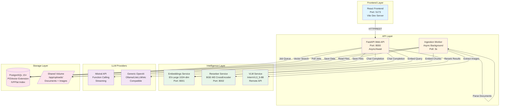
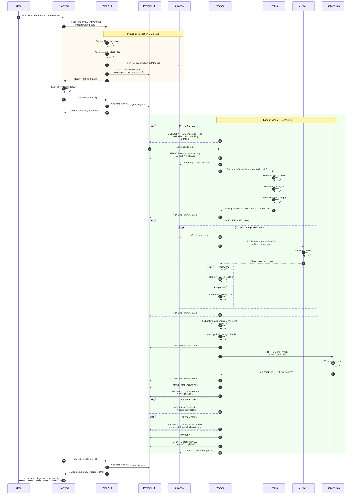
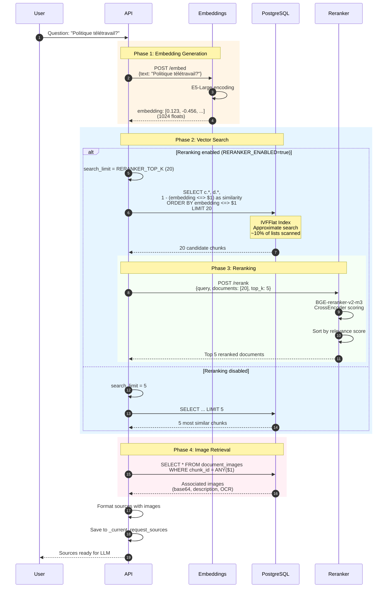
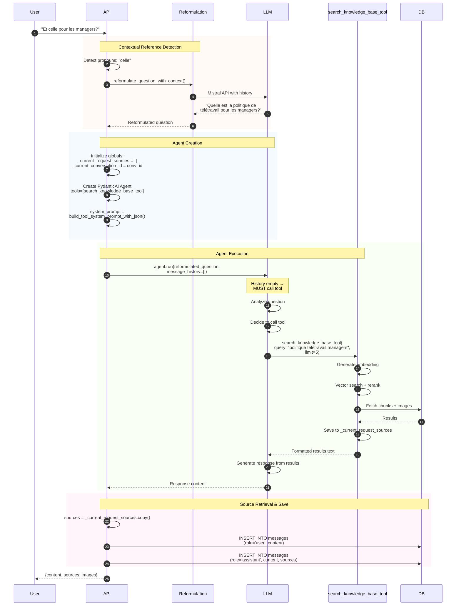
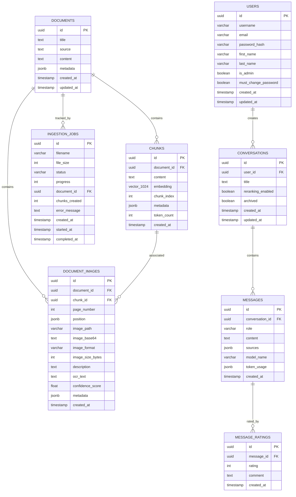
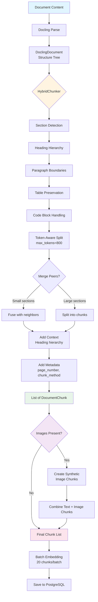
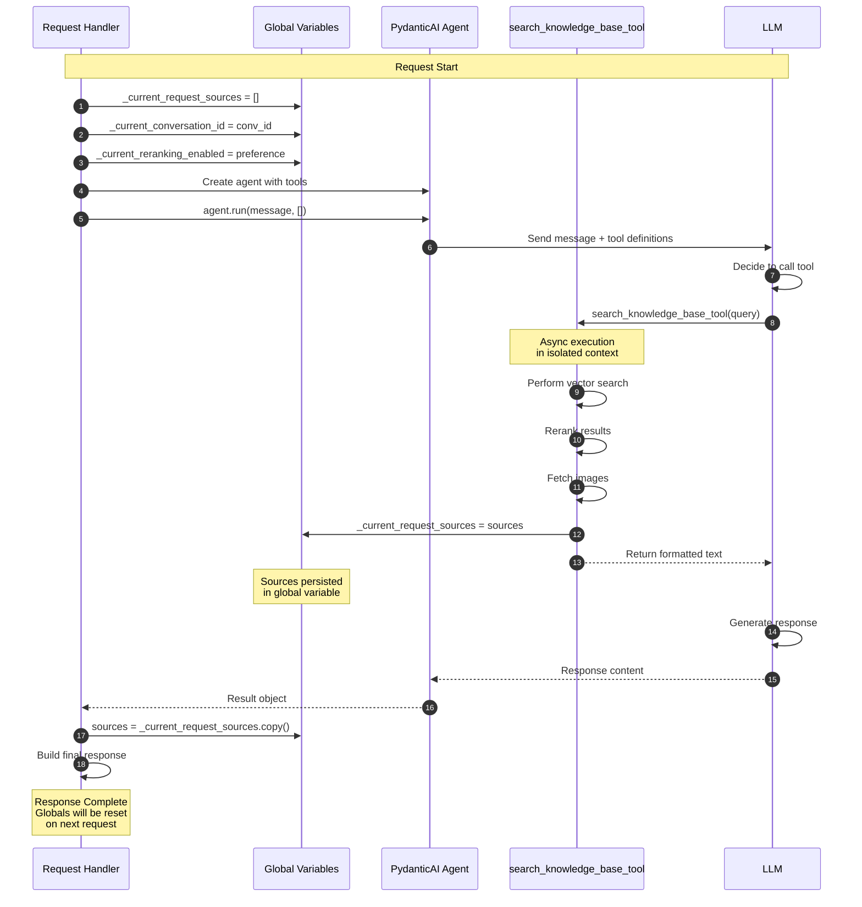
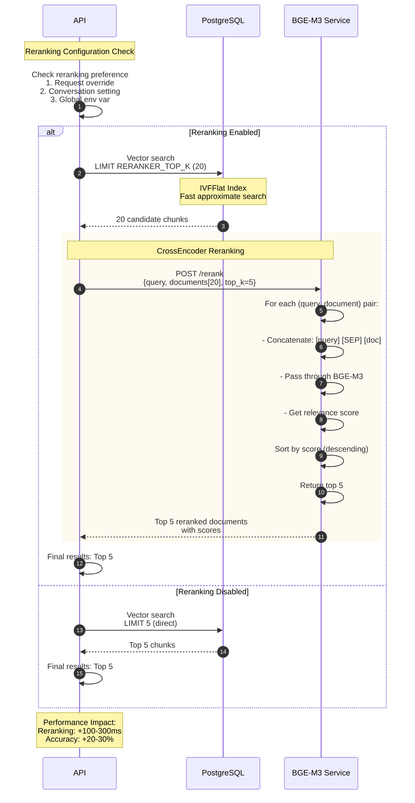

# Diagrammes d'Architecture - Pipeline RAG RAGFab

**Complément à**: `rag_pipeline_documentation.md`
**Date**: 2025-01-24

Ce document contient des diagrammes Mermaid détaillés pour visualiser l'architecture et les flux de données du système RAG.

---

## 1. Architecture globale des services



---

## 2. Flux d'ingestion détaillé (avec VLM)



---

## 3. Flux de recherche vectorielle avec reranking



---

## 4. Flux de génération de réponse (Function Calling)



---

## 5. Schéma de base de données complet



---

## 6. Flux de chunking avec HybridChunker



---

## 7. Comparaison des modes d'exécution

```mermaid
graph TB
    subgraph "Mode 1: Function Calling (LLM_USE_TOOLS=true)"
        FC_START[User Question] --> FC_REFORM[Reformulate if needed]
        FC_REFORM --> FC_AGENT[Create Agent<br/>with tools]
        FC_AGENT --> FC_PROMPT[System Prompt<br/>+ JSON Tool Definition]
        FC_PROMPT --> FC_RUN[Run Agent<br/>message_history=[]]
        FC_RUN --> FC_LLM[LLM Analysis]
        FC_LLM --> FC_CALL[LLM Calls Tool]
        FC_CALL --> FC_SEARCH[search_knowledge_base_tool]
        FC_SEARCH --> FC_SAVE[Save sources to global]
        FC_SAVE --> FC_RETURN[Return results to LLM]
        FC_RETURN --> FC_GEN[LLM Generates Response]
        FC_GEN --> FC_RETRIEVE[Retrieve sources from global]
        FC_RETRIEVE --> FC_RESP[Response + Sources]
    end

    subgraph "Mode 2: Manual Injection (LLM_USE_TOOLS=false)"
        MI_START[User Question] --> MI_SEARCH[Execute search_knowledge_base_tool<br/>manually]
        MI_SEARCH --> MI_SAVE[Save sources to global]
        MI_SAVE --> MI_COPY[Copy sources locally]
        MI_COPY --> MI_INJECT[Inject results in<br/>system prompt]
        MI_INJECT --> MI_SUMMARY[Add conversation summary<br/>last 2 exchanges]
        MI_SUMMARY --> MI_AGENT[Create Agent<br/>NO tools]
        MI_AGENT --> MI_RUN[Run Agent<br/>with enhanced message]
        MI_RUN --> MI_LLM[LLM Generates Response<br/>from context]
        MI_LLM --> MI_RESP[Response + Sources]
    end

    style FC_START fill:#e3f2fd
    style FC_CALL fill:#fff9c4
    style FC_SEARCH fill:#c8e6c9
    style FC_RESP fill:#f8bbd0

    style MI_START fill:#e3f2fd
    style MI_SEARCH fill:#c8e6c9
    style MI_INJECT fill:#fff9c4
    style MI_RESP fill:#f8bbd0
```

---

## 8. Gestion des variables globales



**Pourquoi des globales?**
1. **PydanticAI limitation**: ContextVar perd son état en async
2. **FastAPI séquentiel**: Pas de race condition entre requêtes
3. **Simplicité**: Alternative (Redis) = overhead inutile
4. **Pattern éprouvé**: Fonctionne dans tous les cas testés

---

## 9. Pipeline VLM (Vision Language Model)

```mermaid
graph TB
    START[PDF Document] --> DOCLING[Docling Parser]
    DOCLING --> DETECT[Detect Images<br/>in Pages]

    DETECT --> EXTRACT[Extract Image Data<br/>position, size]

    EXTRACT --> FILTER{Image Filter}
    FILTER -->|Too small| SKIP[Skip image<br/>< 200x200px]
    FILTER -->|Aspect ratio wrong| SKIP
    FILTER -->|Valid| SAVE[Save to /uploads/images/]

    SAVE --> ENCODE[Encode to base64]
    ENCODE --> VLM[Call VLM API]

    VLM --> ANALYZE[InternVL3_5-8B Analysis]
    ANALYZE --> DESC[Generate Description]
    ANALYZE --> OCR[Extract Text (OCR)]

    DESC --> METADATA[Create ImageMetadata]
    OCR --> METADATA

    METADATA --> LINK{Link to Chunk}
    LINK -->|Match page_number| CHUNK[Find corresponding chunk]
    LINK -->|No match| FIRST[Link to first chunk]

    CHUNK --> DB_IMG[Save to document_images]
    FIRST --> DB_IMG

    DB_IMG --> SYNTHETIC[Create Synthetic Chunk]

    SYNTHETIC --> CONTENT[Chunk Content:<br/>- Document context<br/>- Image description<br/>- OCR text<br/>- Keywords]

    CONTENT --> EMBED[Embed Synthetic Chunk]
    EMBED --> DB_CHUNK[Save to chunks table]

    DB_CHUNK --> SEARCH[Image searchable in RAG]

    style START fill:#e1f5ff
    style FILTER fill:#fff4e1
    style VLM fill:#e8f5e9
    style SYNTHETIC fill:#f3e5f5
    style SEARCH fill:#c8e6c9
```

---

## 10. Reranking Pipeline détaillé



**Explication des étapes**:
1. **Vérification config**: Priorité request > conversation > global
2. **Candidates**: Top-20 pour avoir plus de choix pour le reranker
3. **CrossEncoder**: Analyse fine de chaque paire (query, document)
4. **Score**: Plus précis que similarité cosine seule
5. **Fallback**: Si erreur, retourne top-5 du vector search

---

## Conclusion des diagrammes

Ces diagrammes couvrent:
- ✅ Architecture globale des services
- ✅ Flux d'ingestion avec VLM
- ✅ Recherche vectorielle + reranking
- ✅ Génération de réponse (function calling)
- ✅ Schéma de base de données
- ✅ Chunking HybridChunker
- ✅ Comparaison modes d'exécution
- ✅ Gestion variables globales
- ✅ Pipeline VLM
- ✅ Reranking détaillé

**Utilisation**:
- Ces diagrammes sont en format Mermaid
- Affichables dans GitHub, GitLab, VS Code (extensions)
- Exportables en PNG/SVG via mermaid-cli

**Pour aller plus loin**:
- Consulter `rag_pipeline_documentation.md` pour détails textuels
- Explorer le code source pour implémentation exacte
- Tester les différents modes avec variables d'environnement

---

**Dernière mise à jour**: 2025-01-24
