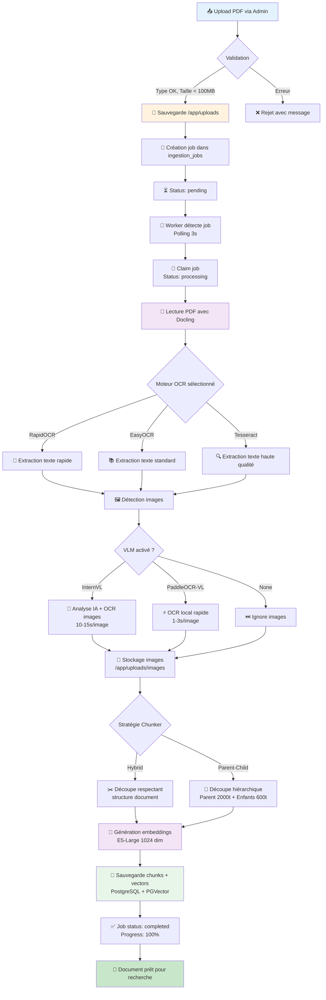
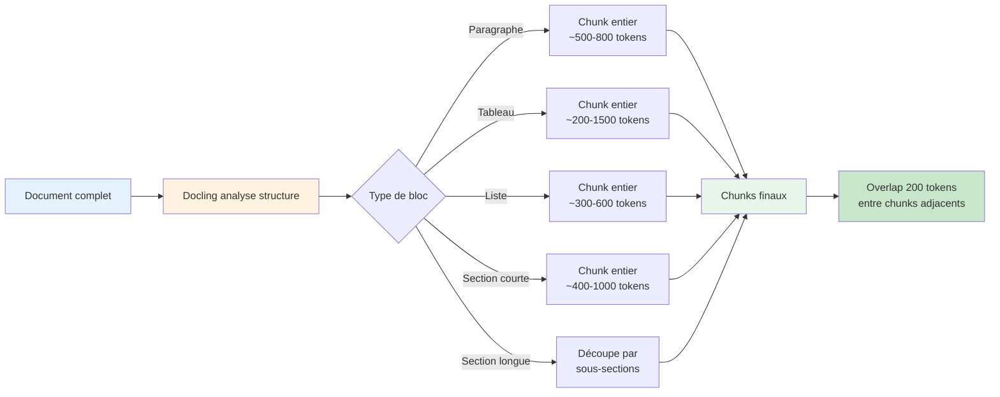
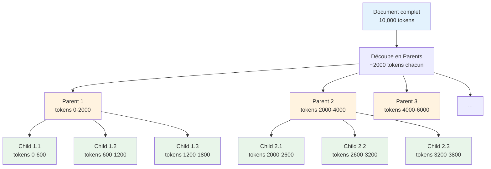
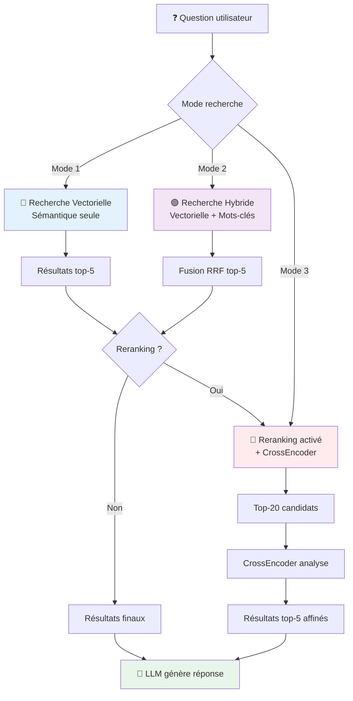
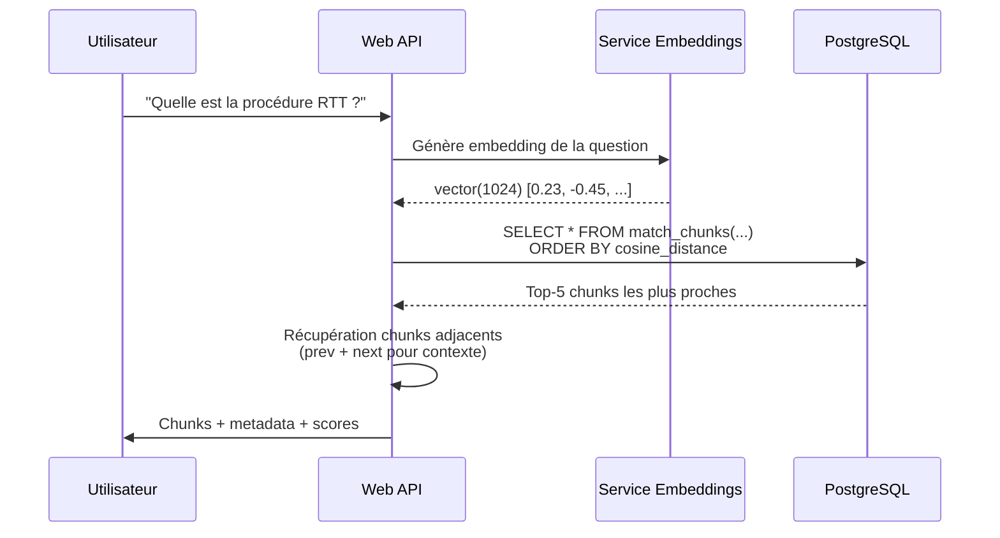
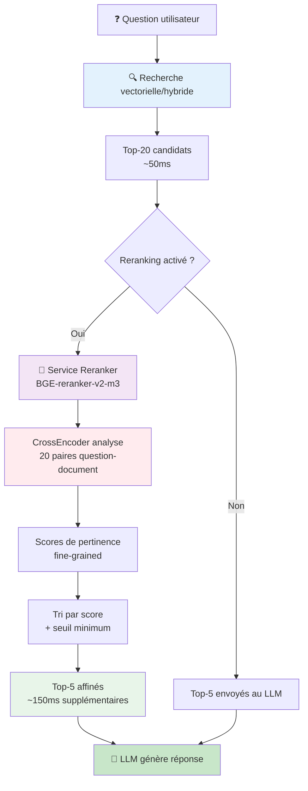

# Guide Administrateur Technique - RAGFab

**Version**: 2.0
**Date**: Janvier 2025
**Public**: Administrateurs système avec connaissances techniques limitées

---

## 📋 Table des matières

1. [Vue d'ensemble de l'architecture](#1-vue-densemble-de-larchitecture)
2. [Interface utilisateur (Frontend)](#2-interface-utilisateur-frontend)
3. [Interface administrateur](#3-interface-administrateur)
4. [Pipeline d'ingestion des documents](#4-pipeline-dingestion-des-documents)
5. [Stratégies de découpage (Chunking)](#5-stratégies-de-découpage-chunking)
6. [Système de recherche](#6-système-de-recherche)
7. [Recherche hybride en détail](#7-recherche-hybride-en-détail)
8. [Reranking (reclassement)](#8-reranking-reclassement)
9. [Système de notation et amélioration](#9-système-de-notation-et-amélioration)
10. [Réingestion des documents](#10-réingestion-des-documents)
11. [Glossaire des termes techniques](#11-glossaire-des-termes-techniques)

---

## 1. Vue d'ensemble de l'architecture

### 1.1 Schéma général du système

RAGFab est composé de **7 composants principaux** qui travaillent ensemble :

```mermaid
graph TB
    subgraph "🌐 Frontend (Interface Web)"
        UI[Interface Utilisateur<br/>Port 5173]
        Admin[Interface Admin<br/>Gestion documents]
    end

    subgraph "🔧 Backend (Serveur)"
        API[Web API FastAPI<br/>Port 8000]
        Worker[Ingestion Worker<br/>Traitement documents]
    end

    subgraph "🧠 Services IA"
        Embed[Service Embeddings<br/>E5-Large<br/>Port 8001]
        Rerank[Service Reranker<br/>BGE-M3<br/>Port 8002]
    end

    subgraph "💾 Stockage"
        DB[(PostgreSQL + PGVector<br/>Port 5432)]
        Files[/app/uploads<br/>Fichiers]
    end

    UI --> API
    Admin --> API
    API --> Embed
    API --> Rerank
    API --> DB
    Worker --> Embed
    Worker --> DB
    Worker --> Files
    API --> Files

    style UI fill:#e3f2fd
    style Admin fill:#e3f2fd
    style API fill:#fff3e0
    style Worker fill:#fff3e0
    style Embed fill:#f3e5f5
    style Rerank fill:#f3e5f5
    style DB fill:#e8f5e9
    style Files fill:#e8f5e9
```

### 1.2 Rôle de chaque composant

| Composant | Rôle | Analogie |
|-----------|------|----------|
| **Frontend** | Interface web où les utilisateurs posent des questions | Le guichet d'accueil d'une bibliothèque |
| **Web API** | Coordonne toutes les opérations, gère les requêtes | Le bibliothécaire qui organise tout |
| **Ingestion Worker** | Traite les documents uploadés en arrière-plan | Le catalogueur qui range les nouveaux livres |
| **Service Embeddings** | Transforme le texte en vecteurs mathématiques | Le système de classification Dewey qui attribue des codes aux livres |
| **Service Reranker** | Affine les résultats de recherche | L'expert qui trie les livres trouvés par pertinence |
| **PostgreSQL** | Stocke documents, chunks et vecteurs | Les rayonnages de la bibliothèque |
| **Fichiers (/app/uploads)** | Stocke les fichiers PDF originaux et images | Les archives avec documents originaux |

---

## 2. Interface utilisateur (Frontend)

### 2.1 Espace de conversation

L'interface principale permet aux utilisateurs de :

```
┌─────────────────────────────────────────────────────────┐
│  RAGFab - Interface de Chat                             │
├─────────────────────────────────────────────────────────┤
│                                                         │
│  👤 Utilisateur: "Quelle est la procédure RTT ?"       │
│                                                         │
│  🤖 Assistant: "La procédure RTT consiste à..."        │
│     📄 Sources:                                         │
│     • Document_RH.pdf (page 12) - Score: 0.89         │
│     • Reglement_interieur.pdf (page 5) - Score: 0.82  │
│                                                         │
│     👍 👎  [Boutons de notation]                       │
│                                                         │
├─────────────────────────────────────────────────────────┤
│  💬 Votre question...                    [Envoyer] 🔍  │
└─────────────────────────────────────────────────────────┘
```

**Fonctionnalités clés** :
- 💬 **Conversation continue** : Le système se souvient du contexte
- 📚 **Affichage des sources** : Chaque réponse cite ses documents sources
- 🎯 **Score de pertinence** : Indique la confiance (0.0 à 1.0)
- 👍👎 **Notation** : Les utilisateurs évaluent la qualité des réponses
- 🖼️ **Images intégrées** : Les diagrammes et tableaux sont affichés

### 2.2 Recherche hybride (toggle + curseur)

L'utilisateur peut activer la recherche hybride pour améliorer les résultats :

```
┌─────────────────────────────────────────────────────────┐
│  🔀 Recherche Hybride                                   │
│  ─────────────────────────────────────────────────────  │
│  [ON]  Activée                                          │
│                                                         │
│  Alpha (équilibre) :                                    │
│  Mots-clés ◄──────●────────► Sémantique                │
│           0.0    0.5      1.0                           │
│                                                         │
│  ℹ️ Recommandations :                                   │
│  • Acronymes (RTT, CDI) → Alpha = 0.3                  │
│  • Questions conceptuelles → Alpha = 0.7               │
│  • Par défaut → Alpha = 0.5 (auto)                     │
└─────────────────────────────────────────────────────────┘
```

**Explication simple** :
- **Curseur à gauche (0.0)** : Recherche par mots-clés exacts (comme Google)
- **Curseur au milieu (0.5)** : Équilibre entre mots-clés et sens
- **Curseur à droite (1.0)** : Recherche par sens (comprend synonymes)

### 2.3 Système de notation

Après chaque réponse, l'utilisateur peut noter avec :

| Action | Signification | Stockage |
|--------|---------------|----------|
| 👍 Pouce vers le haut | Réponse utile et précise | `rating = 'up'` en base |
| 👎 Pouce vers le bas | Réponse incorrecte ou incomplète | `rating = 'down'` en base |

**Utilité** : Ces notes permettent d'identifier les documents à améliorer ou réingérer.

---

## 3. Interface administrateur

### 3.1 Accès à l'interface

L'interface admin est accessible à : `http://localhost:3000/admin`

**Connexion** :
- Seuls les utilisateurs avec `is_admin = true` peuvent y accéder
- Authentification via JWT (token de session)

### 3.2 Upload de documents

L'interface d'upload permet de configurer **3 moteurs indépendants** :

```
┌─────────────────────────────────────────────────────────┐
│  📤 Upload de Documents                                 │
│  ─────────────────────────────────────────────────────  │
│                                                         │
│  📄 Glissez-déposez vos fichiers ici                   │
│     ou cliquez pour sélectionner                        │
│     (PDF, DOCX, MD, TXT, HTML - Max 100MB)            │
│                                                         │
│  ⚙️ Configuration d'ingestion :                         │
│                                                         │
│  ┌──────────────┬──────────────┬──────────────┐       │
│  │ Moteur OCR   │ Moteur VLM   │ Découpage    │       │
│  │ (Docling)    │ (Images)     │ (Chunker)    │       │
│  ├──────────────┼──────────────┼──────────────┤       │
│  │ [RapidOCR ▼] │ [InternVL ▼] │ [Hybrid ▼]   │       │
│  │              │              │              │       │
│  │ • RapidOCR   │ • InternVL   │ • Hybrid     │       │
│  │ • EasyOCR    │ • PaddleOCR  │ • Parent-    │       │
│  │ • Tesseract  │ • Aucun      │   Child      │       │
│  └──────────────┴──────────────┴──────────────┘       │
│                                                         │
│  [Uploader] 🚀                                         │
└─────────────────────────────────────────────────────────┘
```

**Détails de configuration** :

| Moteur | Options | Recommandation |
|--------|---------|----------------|
| **OCR** (extraction texte PDF) | RapidOCR, EasyOCR, Tesseract | **RapidOCR** (rapide + multilingue) |
| **VLM** (analyse images) | InternVL, PaddleOCR-VL, Aucun | **InternVL** (meilleure qualité) |
| **Chunker** (découpage) | Hybrid, Parent-Child | **Hybrid** (documents structurés) |

### 3.3 Gestion des utilisateurs

L'admin peut :
- ✅ Créer de nouveaux utilisateurs
- ✅ Définir les droits (admin ou utilisateur standard)
- ✅ Forcer le changement de mot de passe au premier login
- ✅ Voir la liste des conversations par utilisateur

```sql
-- Structure de la table users
CREATE TABLE users (
    id UUID PRIMARY KEY,
    username VARCHAR(100) UNIQUE NOT NULL,
    email VARCHAR(255) UNIQUE NOT NULL,
    password_hash VARCHAR(255) NOT NULL,
    first_name VARCHAR(100),
    last_name VARCHAR(100),
    is_admin BOOLEAN DEFAULT false,
    must_change_password BOOLEAN DEFAULT false,
    created_at TIMESTAMP DEFAULT NOW()
);
```

### 3.4 Statistiques et monitoring

L'interface admin affiche :

| Statistique | Description | Source |
|-------------|-------------|--------|
| **Documents ingérés** | Nombre total de documents | Table `documents` |
| **Chunks créés** | Nombre total de morceaux de texte | Table `chunks` |
| **Conversations** | Nombre total de sessions | Table `conversations` |
| **Notes positives/négatives** | Ratio de satisfaction | Table `messages` (champ `rating`) |
| **Jobs d'ingestion** | Progression des uploads | Table `ingestion_jobs` |

**Vue temps réel** :
```
┌─────────────────────────────────────────────────────────┐
│  📊 Tableau de bord                                     │
│  ─────────────────────────────────────────────────────  │
│                                                         │
│  📄 Documents :  127 documents  |  2,458 chunks        │
│  💬 Conversations :  342 sessions                       │
│  👍 Satisfaction :  87% positif  (298/342)             │
│  ⏱️ Temps moyen :  2.3s par requête                    │
│                                                         │
│  🔄 Jobs d'ingestion en cours :                        │
│  • manuel_technique.pdf - 67% ▓▓▓▓▓▓▓░░░              │
│  • reglement_securite.pdf - 23% ▓▓░░░░░░░░            │
└─────────────────────────────────────────────────────────┘
```

---

## 4. Pipeline d'ingestion des documents

### 4.1 Schéma complet du pipeline

Voici ce qui se passe **étape par étape** quand un document est uploadé :



### 4.2 Étapes détaillées

#### **Étape 1 : Upload et validation (Frontend → API)**

**Ce qui se passe** :
1. L'admin glisse-dépose un PDF dans l'interface
2. Frontend envoie le fichier + configuration (OCR, VLM, Chunker) à l'API
3. API valide :
   - ✅ Type de fichier (PDF, DOCX, MD, TXT, HTML)
   - ✅ Taille < 100MB
   - ✅ Moteurs sélectionnés valides

**Stockage** :
```
/app/uploads/
  └── {job_id}/
      └── document.pdf  (fichier original)
```

**Base de données** :
```sql
INSERT INTO ingestion_jobs (
    id,
    filename,
    status,           -- 'pending'
    ocr_engine,       -- 'rapidocr', 'easyocr', 'tesseract'
    vlm_engine,       -- 'internvl', 'paddleocr-vl', 'none'
    chunker_type,     -- 'hybrid', 'parent_child'
    created_at
) VALUES (
    '123e4567-...',
    'manuel_technique.pdf',
    'pending',
    'rapidocr',
    'internvl',
    'hybrid',
    NOW()
);
```

#### **Étape 2 : Détection par le Worker**

**Ce qui se passe** :
1. Le Worker (service séparé) interroge la base toutes les **3 secondes**
2. Il cherche les jobs avec `status = 'pending'`
3. Dès qu'il en trouve un, il le "réclame" (claim) :

```sql
UPDATE ingestion_jobs
SET status = 'processing', started_at = NOW()
WHERE id = '123e4567-...'
```

**Pourquoi un Worker séparé ?**
- ✅ Ne bloque pas l'API (traitement asynchrone)
- ✅ Peut traiter plusieurs jobs en parallèle
- ✅ Facile à redémarrer en cas d'erreur
- ✅ Partage le volume `/app/uploads` avec l'API

#### **Étape 3 : Extraction de texte (Docling + OCR)**

**Ce qui se passe** :
1. Le Worker lit le PDF avec **Docling** (bibliothèque avancée)
2. Docling utilise le moteur OCR sélectionné :

| Moteur | Vitesse | Qualité | Meilleur pour |
|--------|---------|---------|---------------|
| **RapidOCR** | ⚡⚡⚡ Rapide (~2s/page) | ⭐⭐⭐ Excellente | PDFs modernes, multilingue |
| **EasyOCR** | ⚡⚡ Standard (~4s/page) | ⭐⭐⭐ Excellente | Fallback robuste |
| **Tesseract** | ⚡ Lent (~6s/page) | ⭐⭐⭐⭐ Très haute | Scans anciens, documents archivés |

**Exemple de sortie** :
```
Page 1: "Introduction\nCe manuel technique décrit..."
Page 2: "Chapitre 1 : Configuration\n1.1 Prérequis..."
...
```

**Métadonnées extraites** :
- Nombre de pages
- Titre (si présent dans métadonnées PDF)
- Auteur (si présent)
- Date de création

#### **Étape 4 : Extraction d'images (VLM)**

**Ce qui se passe** :
1. Docling détecte automatiquement les images dans le PDF
2. Pour chaque image détectée :
   - Extraction de l'image (PNG)
   - Détection de la position (page, x, y, largeur, hauteur)
   - Filtrage (ignore petites icônes < 200x200px)
3. Si VLM activé, analyse de l'image :

**Moteur InternVL** (API distant) :
```
🧠 Analyse IA complète :
• Description sémantique : "Ce diagramme montre le processus..."
• OCR du texte visible : "Étape 1 → Validation → Étape 2"
• Confiance : 0.92
• Temps : ~10-15s/image
```

**Moteur PaddleOCR-VL** (local) :
```
⚡ Analyse rapide :
• OCR multilingue (109 langues)
• Détection de layout (colonnes, tableaux)
• Description structurelle basique
• Temps : ~1-3s/image
```

**Stockage** :
```
/app/uploads/images/
  └── {job_id}/
      ├── image_001.png  (diagramme page 3)
      ├── image_002.png  (tableau page 5)
      └── ...
```

**Base de données** :
```sql
INSERT INTO document_images (
    id,
    document_id,
    chunk_id,           -- Lié au chunk de la même page
    page_number,        -- 3
    position,           -- {"x": 100, "y": 200, "width": 400, "height": 300}
    image_path,         -- '/app/uploads/images/{job_id}/image_001.png'
    image_base64,       -- 'data:image/png;base64,iVBORw0KG...' (pour affichage)
    description,        -- 'Ce diagramme montre...'
    ocr_text,           -- 'Étape 1 → Validation → Étape 2'
    confidence_score    -- 0.92
);
```

#### **Étape 5 : Découpage en chunks**

**Analogie** : Imaginez un livre de 200 pages. Pour faciliter la recherche, on le découpe en **sections logiques** (chapitres, sous-sections). C'est le rôle du Chunker.

**Deux stratégies disponibles** (détaillées dans section 5) :

**Hybrid Chunker** (recommandé pour documents structurés) :
- Respecte la structure du document (titres, paragraphes, tableaux)
- Taille variable selon le contenu (~1500 tokens)
- Ne coupe jamais un paragraphe ou un tableau en deux

**Parent-Child Chunker** (pour longs textes continus) :
- Crée des chunks parents (2000 tokens) pour le contexte
- Les découpe en chunks enfants (600 tokens) pour la recherche
- Optimal pour transcriptions, interviews, romans

**Métadonnées ajoutées à chaque chunk** :
```json
{
  "section_hierarchy": ["Chapitre 1", "1.2 Configuration", "1.2.1 Prérequis"],
  "heading_context": "1.2.1 Prérequis",
  "document_position": 0.15,  // 15% du document
  "prev_chunk_id": "abc-123",
  "next_chunk_id": "def-456",
  "page_number": 3
}
```

#### **Étape 6 : Génération des embeddings**

**Qu'est-ce qu'un embedding ?**

> **Analogie** : Imaginez que chaque morceau de texte est transformé en une "empreinte digitale" mathématique. Cette empreinte capture le **sens** du texte, pas juste les mots.

**Exemple concret** :
```
Texte 1 : "La procédure de télétravail"
Embedding : [0.23, -0.45, 0.78, ..., 0.12]  (1024 nombres)

Texte 2 : "Le règlement du travail à distance"
Embedding : [0.21, -0.43, 0.80, ..., 0.14]  (très proche !)

Texte 3 : "La recette du gâteau au chocolat"
Embedding : [-0.89, 0.12, -0.34, ..., 0.56]  (très différent)
```

**Modèle utilisé** : **E5-Large** (multilingual)
- Dimension : 1024 nombres par embedding
- Multilingue : Français, Anglais, Allemand, Espagnol...
- Qualité : État de l'art pour le français

**Processus** :
1. Le Worker envoie les chunks au service Embeddings (port 8001)
2. Traitement par batch de **20 chunks** à la fois (optimisation)
3. Réception des vecteurs 1024-dim
4. Timeout : 90 secondes (documents très longs)

#### **Étape 7 : Sauvegarde en base de données**

**Ce qui est stocké** :

```sql
-- Table documents
INSERT INTO documents (
    id,
    title,              -- 'manuel_technique.pdf'
    source,             -- '/app/uploads/{job_id}/manuel_technique.pdf'
    metadata,           -- {"pages": 42, "author": "Service RH"}
    created_at
);

-- Table chunks (pour chaque morceau)
INSERT INTO chunks (
    id,
    document_id,        -- Lien vers le document parent
    content,            -- Le texte du chunk
    embedding,          -- vector(1024) - l'empreinte mathématique
    chunk_index,        -- Position dans le document (0, 1, 2, ...)
    metadata,           -- Métadonnées spécifiques

    -- Métadonnées structurelles (Phase 2.1)
    prev_chunk_id,      -- Chunk précédent (contexte)
    next_chunk_id,      -- Chunk suivant (contexte)
    section_hierarchy,  -- ["Chapitre 1", "1.2 Config"]
    heading_context,    -- "1.2 Configuration"
    document_position,  -- 0.15 (15% du doc)

    -- Métadonnées hiérarchiques (Phase 2.3)
    chunk_level,        -- 'parent' ou 'child'
    parent_chunk_id,    -- Si child, lien vers parent

    -- Métadonnées générales
    token_count,        -- Nombre de tokens
    page_number,        -- Numéro de page
    created_at
);
```

**Liens établis** :
1. Chunks → Document (via `document_id`)
2. Chunks → Chunks précédents/suivants (via `prev_chunk_id`, `next_chunk_id`)
3. Chunks enfants → Chunks parents (via `parent_chunk_id`)
4. Images → Chunks (via `chunk_id` + `page_number`)

#### **Étape 8 : Finalisation**

**Ce qui se passe** :
1. Worker met à jour le job :
```sql
UPDATE ingestion_jobs
SET
    status = 'completed',
    progress = 100,
    chunks_created = 127,
    completed_at = NOW()
WHERE id = '123e4567-...';
```

2. Frontend interroge l'API toutes les **2 secondes** pour le statut
3. Dès que `status = 'completed'`, document apparaît dans l'interface admin
4. Le document est **immédiatement recherchable** par les utilisateurs

**Durée totale typique** :
- PDF 10 pages, Hybrid, RapidOCR, sans images : **~15-20 secondes**
- PDF 50 pages, Hybrid, RapidOCR, 10 images avec InternVL : **~3-4 minutes**
- PDF 200 pages, Parent-Child, Tesseract, 50 images : **~15-20 minutes**

---

## 5. Stratégies de découpage (Chunking)

### 5.1 Pourquoi découper les documents ?

**Problème** : Un document de 100 pages ne peut pas être envoyé en entier au modèle d'IA (limite de tokens).

**Solution** : Découper en **morceaux (chunks)** plus petits, puis chercher les plus pertinents.

**Analogie** : Au lieu de lire un livre entier pour répondre à une question, on consulte seulement les chapitres pertinents.

### 5.2 Hybrid Chunker (par défaut)

#### **Principe**

Le Hybrid Chunker **respecte la structure logique du document** :
- Ne coupe jamais un paragraphe en deux
- Garde les tableaux entiers
- Respecte les sections et sous-sections
- Préserve les listes à puces

#### **Schéma de fonctionnement**



#### **Exemple concret**

**Document source** :
```
Chapitre 1 : Configuration du système
1.1 Prérequis
Pour installer le logiciel, vous devez disposer de :
- Windows 10 ou supérieur
- 8 GB de RAM minimum
- 20 GB d'espace disque

1.2 Installation
Suivez ces étapes pour installer le logiciel :
1. Téléchargez le fichier d'installation
2. Exécutez setup.exe avec droits admin
3. Suivez l'assistant d'installation
[... 500 mots supplémentaires ...]

1.3 Configuration post-installation
[... contenu ...]
```

**Résultat du découpage Hybrid** :

```
┌─────────────────────────────────────────────────────────┐
│ Chunk 1 (document_position: 0.00-0.08)                 │
│ Section: ["Chapitre 1", "1.1 Prérequis"]              │
├─────────────────────────────────────────────────────────┤
│ Chapitre 1 : Configuration du système                  │
│ 1.1 Prérequis                                          │
│ Pour installer le logiciel, vous devez disposer de :   │
│ - Windows 10 ou supérieur                              │
│ - 8 GB de RAM minimum                                  │
│ - 20 GB d'espace disque                                │
│                                                         │
│ Metadata:                                               │
│ • prev_chunk_id: null                                   │
│ • next_chunk_id: chunk-002                              │
│ • heading_context: "1.1 Prérequis"                      │
└─────────────────────────────────────────────────────────┘

┌─────────────────────────────────────────────────────────┐
│ Chunk 2 (document_position: 0.08-0.45)                 │
│ Section: ["Chapitre 1", "1.2 Installation"]           │
├─────────────────────────────────────────────────────────┤
│ [Overlap 200 tokens du chunk 1]                        │
│                                                         │
│ 1.2 Installation                                        │
│ Suivez ces étapes pour installer le logiciel :         │
│ 1. Téléchargez le fichier d'installation              │
│ 2. Exécutez setup.exe avec droits admin               │
│ 3. Suivez l'assistant d'installation                   │
│ [... reste du contenu ...]                             │
│                                                         │
│ Metadata:                                               │
│ • prev_chunk_id: chunk-001                              │
│ • next_chunk_id: chunk-003                              │
│ • heading_context: "1.2 Installation"                   │
└─────────────────────────────────────────────────────────┘
```

**Avantages** :
- ✅ **Contexte préservé** : Chaque chunk a du sens seul
- ✅ **Structure claire** : On sait toujours dans quelle section on est
- ✅ **Tableaux intacts** : Pas de tableaux coupés en deux
- ✅ **Overlap intelligent** : 200 tokens partagés entre chunks adjacents

**Inconvénients** :
- ⚠️ **Taille variable** : Chunks de 300 à 2000 tokens (selon structure)
- ⚠️ **Peut couper sections longues** : Si une section fait 5000 tokens

### 5.3 Parent-Child Chunker (pour textes longs)

#### **Principe**

Le Parent-Child Chunker crée une **architecture à deux niveaux** :
1. **Chunks parents** (2000 tokens) : Contexte riche pour le LLM
2. **Chunks enfants** (600 tokens) : Précision pour la recherche

**Analogie** : C'est comme un livre avec des chapitres (parents) divisés en paragraphes (enfants). On cherche dans les paragraphes, mais on lit les chapitres complets.

#### **Schéma de fonctionnement**



#### **Comment ça marche en pratique ?**

**Lors de l'ingestion** :
1. Document découpé en chunks parents (2000 tokens)
2. Chaque parent découpé en 3-5 enfants (600 tokens)
3. Stockage en base :
   - Parents : `chunk_level = 'parent'`
   - Enfants : `chunk_level = 'child'` + `parent_chunk_id = {uuid_parent}`

**Lors de la recherche** :
1. Recherche vectorielle opère sur les **enfants** (plus précis)
2. Les enfants trouvés renvoient leurs **parents** (contexte riche)
3. Le LLM reçoit les parents complets (2000 tokens)

#### **Exemple concret**

**Document source** : Transcription d'interview (20,000 tokens)

**Stockage** :

```sql
-- Parent 1
INSERT INTO chunks (
    id = 'parent-001',
    content = '[10 minutes de conversation complète]',  -- 2000 tokens
    chunk_level = 'parent',
    parent_chunk_id = null
);

-- Enfants du Parent 1
INSERT INTO chunks (
    id = 'child-001-1',
    content = '[2 premières minutes]',  -- 600 tokens
    chunk_level = 'child',
    parent_chunk_id = 'parent-001'
);

INSERT INTO chunks (
    id = 'child-001-2',
    content = '[Minutes 2-4]',  -- 600 tokens
    chunk_level = 'child',
    parent_chunk_id = 'parent-001'
);

-- ... etc pour les autres enfants
```

**Lors d'une recherche** :

```
Question : "Que pense le candidat de la flexibilité ?"

1. Recherche vectorielle trouve :
   • child-001-3 (score: 0.87) - "Je valorise la flexibilité..."
   • child-003-1 (score: 0.82) - "...équilibre vie pro/perso..."

2. Système récupère les parents correspondants :
   • parent-001 (contexte : 2000 tokens autour de la flexibilité)
   • parent-003 (contexte : 2000 tokens sur équilibre)

3. LLM reçoit les parents complets → Réponse riche en contexte
```

**Avantages** :
- ✅ **Meilleure précision** : Recherche sur petits chunks (600t)
- ✅ **Contexte riche** : LLM reçoit gros chunks (2000t)
- ✅ **Moins de hallucination** : Plus d'information autour du passage trouvé

**Inconvénients** :
- ⚠️ **Plus de stockage** : 3-5x plus de chunks (parents + enfants)
- ⚠️ **Peut couper sections** : Ne respecte pas toujours la structure logique
- ⚠️ **Ingestion plus lente** : +20-30% de temps de traitement

### 5.4 Tableau comparatif

| Critère | Hybrid Chunker | Parent-Child Chunker |
|---------|----------------|----------------------|
| **Type de document** | Documents structurés (manuels, rapports) | Textes longs continus (interviews, transcriptions) |
| **Respect de la structure** | ✅ Oui (sections, tableaux intacts) | ⚠️ Partiel (peut couper sections) |
| **Taille des chunks** | Variable (300-2000 tokens) | Fixe (Parents: 2000t, Enfants: 600t) |
| **Stockage** | 1x (chunks normaux) | 3-5x (parents + enfants) |
| **Temps d'ingestion** | Standard (baseline) | +20-30% |
| **Qualité recherche** | ⭐⭐⭐ Bonne | ⭐⭐⭐⭐ Excellente (précision) |
| **Contexte LLM** | ⭐⭐⭐ Bon | ⭐⭐⭐⭐ Très riche |
| **Migration requise** | ❌ Non (par défaut) | ✅ Oui (migration 06) |

### 5.5 Quand utiliser l'un ou l'autre ?

**Utilisez Hybrid Chunker pour** :
- 📚 Manuels techniques
- 📊 Rapports avec tableaux et graphiques
- 📋 Documentation structurée (API, procédures)
- 🏥 Protocoles médicaux (étapes séquentielles)
- 📑 Contrats juridiques (articles, clauses)

**Utilisez Parent-Child Chunker pour** :
- 🎙️ Transcriptions d'interviews
- 📖 Chapitres de livres (longs textes narratifs)
- 💬 Conversations / dialogues
- 📝 Articles de blog / essais (peu structurés)
- 🎬 Sous-titres de vidéos

**Conseil pratique** :
> Commencez toujours avec **Hybrid** (défaut). Si les résultats de recherche manquent de contexte ou si le document est très long et peu structuré, testez **Parent-Child** sur le même document et comparez.

---

## 6. Système de recherche

### 6.1 Vue d'ensemble des types de recherche

RAGFab propose **3 modes de recherche** combinables :



### 6.2 Recherche vectorielle (sémantique)

#### **Comment ça marche ?**

**Analogie** : Imaginez une bibliothèque où chaque livre a une "empreinte digitale" mathématique. Pour trouver un livre, on compare l'empreinte de votre question avec celles des livres, et on prend les plus proches.

**Processus technique** :



**Fonction SQL utilisée** :
```sql
SELECT
    c.id,
    c.content,
    c.metadata,
    c.section_hierarchy,
    c.heading_context,
    (1 - (c.embedding <=> $1)) AS similarity_score,  -- Cosine similarity
    d.title AS document_title,
    d.source AS document_source
FROM chunks c
JOIN documents d ON c.document_id = d.id
ORDER BY c.embedding <=> $1  -- <=> = cosine distance
LIMIT 5;
```

**Exemple concret** :

```
Question : "procédure de télétravail"
→ Embedding : [0.23, -0.45, 0.78, ..., 0.12]

Chunk 1 : "La procédure de travail à distance..."
→ Embedding : [0.21, -0.43, 0.80, ..., 0.14]
→ Distance cosine : 0.12 → Similarité : 0.88 ✅

Chunk 2 : "Le règlement concernant le remote work..."
→ Embedding : [0.19, -0.40, 0.82, ..., 0.16]
→ Distance cosine : 0.18 → Similarité : 0.82 ✅

Chunk 3 : "Les horaires d'ouverture de la cantine..."
→ Embedding : [-0.67, 0.23, -0.12, ..., 0.45]
→ Distance cosine : 0.89 → Similarité : 0.11 ❌
```

**Forces** :
- ✅ Comprend les **synonymes** (télétravail = remote work = travail à distance)
- ✅ Capture le **sens** au-delà des mots exacts
- ✅ Multilingue (français/anglais mélangés)

**Faiblesses** :
- ❌ Peut rater les **acronymes** (RTT, CDI, PeopleDoc)
- ❌ Peut rater les **noms propres** (logiciels, marques)
- ❌ Moins précis sur **termes techniques rares**

### 6.3 Récupération des chunks adjacents

**Problème résolu** : Un chunk seul peut manquer de contexte.

**Solution** : Pour chaque chunk trouvé, récupérer aussi le chunk **précédent** et **suivant**.

**Exemple** :

```
┌─────────────────────────────────────────────────────────┐
│ Chunk trouvé (score: 0.89)                             │
│ Section: ["Chapitre 2", "2.3 Télétravail"]            │
├─────────────────────────────────────────────────────────┤
│ ⬆️ Contexte précédent (prev_chunk_id):                 │
│ "...conditions d'éligibilité au télétravail..."        │
│                                                         │
│ ━━━━━━━━━━━━━━━━━━━━━━━━━━━━━━━━━━━━━━━━━━━━━━━━━━━ │
│ 📍 CHUNK PRINCIPAL (celui qui match):                  │
│ "La procédure de demande de télétravail se fait        │
│  via le portail RH. Le salarié doit soumettre..."      │
│ ━━━━━━━━━━━━━━━━━━━━━━━━━━━━━━━━━━━━━━━━━━━━━━━━━━━ │
│                                                         │
│ ⬇️ Contexte suivant (next_chunk_id):                   │
│ "...validation par le manager dans les 48h..."         │
└─────────────────────────────────────────────────────────┘
```

**Activation** : Variable d'environnement
```bash
USE_ADJACENT_CHUNKS=true  # Recommandé (latence négligeable)
```

**Impact** :
- ⏱️ Latence : +5-20ms (1 seule requête SQL avec JOIN)
- 💾 Tokens : +300-900 tokens par résultat (prev + next)
- 📈 Qualité : +15-25% de pertinence (estimation)

### 6.4 Fonction de recherche intelligente

RAGFab utilise une fonction PostgreSQL avancée qui gère **automatiquement** les chunks parents/enfants :

```sql
CREATE FUNCTION match_chunks_smart(
    query_embedding vector(1024),
    match_count INT DEFAULT 5
)
RETURNS TABLE(...) AS $
BEGIN
    -- Détection automatique : Y a-t-il des chunks parent-child ?
    IF EXISTS (SELECT 1 FROM chunks WHERE chunk_level = 'child') THEN
        -- Mode parent-child : Cherche dans enfants, retourne parents
        RETURN QUERY
        SELECT DISTINCT p.*
        FROM chunks c
        JOIN chunks p ON c.parent_chunk_id = p.id
        WHERE c.chunk_level = 'child'
        ORDER BY c.embedding <=> query_embedding
        LIMIT match_count;
    ELSE
        -- Mode standard : Recherche directe
        RETURN QUERY
        SELECT *
        FROM chunks
        ORDER BY embedding <=> query_embedding
        LIMIT match_count;
    END IF;
END;
$ LANGUAGE plpgsql;
```

**Avantage** : Pas besoin de savoir quel type de chunking a été utilisé. La fonction s'adapte automatiquement.

---

## 7. Recherche hybride en détail

### 7.1 Pourquoi la recherche hybride ?

**Problème identifié** : La recherche vectorielle (sémantique) peut rater des termes spécifiques.

**Cas problématiques** :
- **Acronymes** : RTT, CDI, PeopleDoc, SIRH
- **Noms propres** : Noms de logiciels, marques, personnes
- **Termes techniques** : Nomenclatures, codes, références
- **Expressions exactes** : "congés payés", "rupture conventionnelle"

**Exemple réel** :

```
❌ AVANT (vectorielle seule) :
Question : "procédure RTT"
→ Trouve : Documents sur "temps de travail", "horaires", "planning"
→ Rate : Le document spécifique avec l'acronyme "RTT"

✅ APRÈS (hybride) :
Question : "procédure RTT"
→ Trouve : Documents contenant explicitement "RTT" ET similaires sémantiquement
→ Score combiné = 70% sémantique + 30% mots-clés
```

### 7.2 Analogie simple : La bibliothèque

**Recherche vectorielle** = Demander au bibliothécaire "Parlez-moi de livres sur les voyages"
- Il comprend le **sens** et vous propose des livres sur l'aventure, l'exploration, le tourisme

**Recherche par mots-clés** = Chercher dans le catalogue "Livres contenant le mot 'Madagascar'"
- Recherche **littérale**, trouve exactement ce mot

**Recherche hybride** = Les deux combinés avec un curseur :
- **Curseur à gauche (alpha=0.3)** : "Je veux d'abord les livres avec 'Madagascar', puis ceux sur les voyages"
- **Curseur au milieu (alpha=0.5)** : "Équilibre entre 'Madagascar' exact et livres sur voyages exotiques"
- **Curseur à droite (alpha=0.7)** : "Privilégie le sens général 'voyages', mais boost si 'Madagascar' apparaît"

### 7.3 Comment ça fonctionne techniquement ?

#### **RRF (Reciprocal Rank Fusion)**

**Principe** : Combiner deux listes de résultats en une seule, en respectant un équilibre.

**Formule mathématique** :
```
score_combiné = alpha × (1 / (k + rang_vectoriel))
              + (1 - alpha) × (1 / (k + rang_mots_clés))

Où :
• k = 60 (constante RRF standard pour stabilité)
• alpha = poids entre 0.0 et 1.0
• rang = position dans la liste (1er = 1, 2e = 2, etc.)
```

**Exemple concret** :

```
Question : "procédure RTT"
Alpha : 0.5 (équilibre)

Résultats recherche VECTORIELLE :
1. doc_A (score vector: 0.89)
2. doc_B (score vector: 0.82)
3. doc_C (score vector: 0.78)
4. doc_D (score vector: 0.71)
5. doc_E (score vector: 0.68)

Résultats recherche MOTS-CLÉS (BM25) :
1. doc_D (contient "RTT" 5 fois)
2. doc_A (contient "RTT" 2 fois)
3. doc_F (contient "RTT" 1 fois)
4. doc_B (contient "procédure" 3 fois)
5. doc_G (contient "procédure" 2 fois)

Calcul RRF pour doc_A :
• rang_vectoriel = 1
• rang_mots_clés = 2
• score_combiné = 0.5 × (1/(60+1)) + 0.5 × (1/(60+2))
•               = 0.5 × 0.0164 + 0.5 × 0.0161
•               = 0.0163

Calcul RRF pour doc_D :
• rang_vectoriel = 4
• rang_mots_clés = 1
• score_combiné = 0.5 × (1/(60+4)) + 0.5 × (1/(60+1))
•               = 0.5 × 0.0156 + 0.5 × 0.0164
•               = 0.0160

CLASSEMENT FINAL HYBRIDE :
1. doc_A (0.0163) ← Meilleur équilibre
2. doc_D (0.0160) ← Bon sur mots-clés, moyen sur sémantique
3. doc_B (0.0154)
4. doc_C (0.0148)
5. doc_F (0.0142)
```

#### **Preprocessing de la requête**

Avant la recherche par mots-clés, la requête est **nettoyée** :

**Étapes** :
1. **Suppression des stopwords français** (130+ mots) :
   - Avant : "Quelle est la procédure pour demander le RTT ?"
   - Après : "procédure demander RTT"

2. **Préservation des éléments importants** :
   - Acronymes (2+ lettres maj) : RTT, CDI, PeopleDoc ✅
   - Noms propres (maj après 1er mot) : "logiciel PeopleDoc" ✅
   - Nombres : 2024, 30%, 15 jours ✅

3. **Conversion en tsquery PostgreSQL** :
   - "procédure demander RTT" → `procédure & demander & RTT`
   - Opérateur AND implicite entre mots

**Code Python** :
```python
def preprocess_query_for_tsquery(query: str) -> str:
    # Stopwords français
    stopwords = ["le", "la", "les", "un", "une", "de", "du", "des", ...]

    # Tokenize
    words = query.split()

    # Garde : acronymes, noms propres, mots significatifs
    filtered = [
        word for word in words
        if word.lower() not in stopwords
        or re.match(r'^[A-Z]{2,}$', word)  # Acronymes
    ]

    # Combine avec &
    return " & ".join(filtered)
```

#### **Calcul alpha adaptatif**

RAGFab ajuste **automatiquement** l'alpha selon le type de question :

```python
def adaptive_alpha(query: str) -> float:
    """
    Retourne l'alpha optimal selon la nature de la requête.
    """
    query_lower = query.lower()
    words = query.split()

    # CAS 1 : Acronymes détectés → Bias mots-clés
    if re.search(r'\b[A-Z]{2,}\b', query):
        return 0.3  # 30% sémantique, 70% mots-clés

    # CAS 2 : Noms propres (maj après 1er mot) → Bias mots-clés
    proper_nouns = [w for w in words[1:] if w[0].isupper()]
    if proper_nouns:
        return 0.3

    # CAS 3 : Questions conceptuelles → Bias sémantique
    conceptual = ["pourquoi", "comment", "expliquer", "signifie"]
    if any(kw in query_lower for kw in conceptual):
        return 0.7  # 70% sémantique, 30% mots-clés

    # CAS 4 : Questions courtes (≤4 mots) → Léger bias mots-clés
    if len(words) <= 4:
        return 0.4

    # CAS 5 : Par défaut → Équilibre
    return 0.5
```

**Exemples d'alpha adaptatif** :

| Question | Alpha calculé | Raison |
|----------|---------------|--------|
| "procédure RTT" | 0.3 | Acronyme détecté |
| "logiciel PeopleDoc" | 0.3 | Nom propre détecté |
| "Pourquoi favoriser le télétravail ?" | 0.7 | Question conceptuelle |
| "congés payés" | 0.4 | Question courte (2 mots) |
| "Quelle est la procédure de demande de télétravail ?" | 0.5 | Question standard |

### 7.4 Interface utilisateur : Le curseur alpha

**Affichage dans le frontend** :

```
┌─────────────────────────────────────────────────────────┐
│  🔀 Recherche Hybride                                   │
│  ─────────────────────────────────────────────────────  │
│  [ON]  Activée                                          │
│                                                         │
│  Ajuster l'équilibre :                                  │
│  Mots-clés ◄──────●────────► Sémantique                │
│           0.0    0.5      1.0                           │
│           ↑ (actuel: auto)                              │
│                                                         │
│  💡 Exemples d'utilisation :                            │
│  • Acronymes (RTT, CDI) → 0.3 (auto)                   │
│  • Questions de sens → 0.7 (auto)                      │
│  • Forcer mots-clés → Déplacer vers 0.0               │
│                                                         │
│  ℹ️ Mode AUTO activé : L'alpha s'adapte automatiquement│
│     à votre question. Déplacez le curseur pour forcer  │
│     un équilibre manuel.                                │
└─────────────────────────────────────────────────────────┘
```

**Comportement** :
1. **Par défaut** : Mode AUTO (curseur grisé, alpha calculé automatiquement)
2. **Déplacement manuel** : Désactive AUTO, alpha fixé par l'utilisateur
3. **Réinitialisation** : Bouton "AUTO" pour revenir au mode adaptatif

### 7.5 BM25 : L'algorithme de mots-clés

**Qu'est-ce que BM25 ?**

> BM25 (Best Matching 25) est un algorithme qui calcule la pertinence d'un document par rapport à une requête, basé sur la **fréquence des mots-clés**.

**Critères considérés** :
1. **Fréquence du terme** : Combien de fois le mot apparaît dans le document
2. **Longueur du document** : Pénalise les documents très longs
3. **Rareté du terme** : Les mots rares valent plus (IDF = Inverse Document Frequency)

**Exemple** :

```
Question : "procédure RTT"

Document A (1000 mots) :
• Contient "RTT" 5 fois
• Contient "procédure" 3 fois
→ Score BM25 élevé (beaucoup d'occurrences)

Document B (5000 mots) :
• Contient "RTT" 5 fois
• Contient "procédure" 3 fois
→ Score BM25 moyen (pénalité longueur)

Document C (500 mots) :
• Contient "RTT" 1 fois
• Ne contient pas "procédure"
→ Score BM25 faible
```

**PostgreSQL Full-Text Search** :

RAGFab utilise le système de recherche full-text natif de PostgreSQL avec **configuration française** :

```sql
-- Colonne précalculée avec stemming français
ALTER TABLE chunks ADD COLUMN content_tsv tsvector;

-- Index GIN pour recherche rapide
CREATE INDEX idx_chunks_content_tsv ON chunks USING GIN(content_tsv);

-- Trigger de mise à jour automatique
CREATE TRIGGER tsvector_update
    BEFORE INSERT OR UPDATE ON chunks
    FOR EACH ROW
    EXECUTE FUNCTION chunks_tsvector_update();

-- Fonction de mise à jour
CREATE FUNCTION chunks_tsvector_update() RETURNS trigger AS $
BEGIN
    NEW.content_tsv := to_tsvector('french', NEW.content);
    RETURN NEW;
END;
$ LANGUAGE plpgsql;
```

**Stemming français** :
```
"télétravaillent" → "teletravail" (racine)
"procédures" → "procedur" (racine)
"demander" → "demand" (racine)
```

### 7.6 Activation et configuration

**Variables d'environnement** :

```bash
# Activer la recherche hybride
HYBRID_SEARCH_ENABLED=true

# (Optionnel) Forcer un alpha par défaut (sinon adaptatif)
# HYBRID_SEARCH_DEFAULT_ALPHA=0.5
```

**Migration requise** :

```bash
# Appliquer la migration qui crée content_tsv + index
docker-compose exec postgres psql -U raguser -d ragdb \
  -f /docker-entrypoint-initdb.d/10_hybrid_search.sql

# Vérifier que la colonne est peuplée
docker-compose exec postgres psql -U raguser -d ragdb \
  -c "SELECT COUNT(*) FROM chunks WHERE content_tsv IS NOT NULL;"
```

**Logs de débogage** :

Avec `HYBRID_SEARCH_ENABLED=true`, les logs affichent :

```
🔀 Hybrid search: query='procédure RTT' → tsquery='procédure & RTT', alpha=0.30, k=5
INFO - Acronyme détecté, alpha=0.3 (keyword bias)
✅ Hybrid search: 5 résultats | Scores moyens - Vector: 0.765, BM25: 0.543, Combined: 0.0158
```

### 7.7 Performance et impact

**Latence supplémentaire** :
- Recherche vectorielle seule : ~30-50ms
- Recherche hybride : ~80-120ms (+50-100ms)
  - Vectorielle : ~30ms
  - BM25 : ~10-20ms (grâce à l'index GIN)
  - Fusion RRF : ~5-10ms

**Stockage supplémentaire** :
- Colonne `content_tsv` : ~15-25% de la taille du contenu original
- Index GIN : ~20-30% de la taille du contenu
- Total : ~35-55% de surcharge par chunk

**Amélioration qualité** :
- Acronymes : **+25-35% de Recall@5**
- Noms propres : **+20-30%**
- Expressions exactes : **+30-40%**
- Moyenne générale : **+15-25%**

---

## 8. Reranking (reclassement)

### 8.1 Qu'est-ce que le reranking ?

**Analogie** : Imaginez que vous demandez à 20 étudiants de rédiger un résumé. Vous en sélectionnez 5 rapidement (recherche vectorielle), puis un expert les relit attentivement et les reclasse par qualité (reranking).

**Principe** :
1. **Première passe** : Recherche vectorielle/hybride rapide → Top-20 candidats
2. **Deuxième passe** : Modèle CrossEncoder analyse finement chaque paire (question, document)
3. **Résultat** : Top-5 vraiment pertinents envoyés au LLM

**Pourquoi ça marche mieux ?**

La recherche vectorielle est **rapide** mais **approximative** :
- Elle compare des embeddings (vecteurs fixes)
- Ne considère pas l'interaction question-document

Le reranker est **lent** mais **précis** :
- Il analyse la paire complète (question + document) ensemble
- Détecte les nuances, synonymes, contexte

### 8.2 Schéma du pipeline avec reranking



### 8.3 Modèle utilisé : BGE-reranker-v2-m3

**Spécifications** :

| Caractéristique | Détail |
|-----------------|--------|
| **Nom complet** | BAAI/bge-reranker-v2-m3 |
| **Type** | CrossEncoder (BERT-based) |
| **Langues** | Multilingue (100+ langues) |
| **Taille** | ~560M paramètres |
| **Performance** | État de l'art pour le français |
| **Latence** | ~7-10ms par paire |

**Pourquoi ce modèle ?**
- ✅ Excellent pour le français (entraîné sur corpus multilingue)
- ✅ Comprend les nuances sémantiques fines
- ✅ Gère bien les termes techniques et médicaux
- ✅ Équilibre performance/qualité optimal

### 8.4 Comment fonctionne un CrossEncoder ?

**Différence avec BiEncoder (vectoriel)** :

```
┌─────────────────────────────────────────────────────────┐
│ BiEncoder (Recherche vectorielle)                       │
├─────────────────────────────────────────────────────────┤
│                                                         │
│  Question → Embedding [0.23, -0.45, ...]               │
│  Document → Embedding [0.21, -0.43, ...]               │
│                                                         │
│  Similarité = Cosine distance entre vecteurs           │
│               (calcul rapide mais approximatif)         │
└─────────────────────────────────────────────────────────┘

┌─────────────────────────────────────────────────────────┐
│ CrossEncoder (Reranking)                                │
├─────────────────────────────────────────────────────────┤
│                                                         │
│  Input : [CLS] Question [SEP] Document [SEP]           │
│           ↓                                             │
│  BERT analyze l'interaction complète                    │
│           ↓                                             │
│  Output : Score de pertinence (0.0 à 1.0)              │
│           (analyse profonde mais lente)                 │
└─────────────────────────────────────────────────────────┘
```

**Exemple concret** :

```
Question : "Quelle est la procédure de télétravail ?"

Document A : "Le télétravail est encadré par l'accord..."
→ BiEncoder : score = 0.82 (vecteurs proches)
→ CrossEncoder : score = 0.94 (vraiment pertinent !)

Document B : "Le travail à distance nécessite une demande..."
→ BiEncoder : score = 0.78 (vecteurs moins proches)
→ CrossEncoder : score = 0.91 (aussi pertinent, synonyme)

Document C : "Les horaires de travail sont de 9h à 17h..."
→ BiEncoder : score = 0.75 (contient "travail")
→ CrossEncoder : score = 0.23 (pas pertinent pour télétravail)
```

**Résultat** : Le CrossEncoder détecte que Document B est très pertinent malgré un score vectoriel moyen (il comprend que "travail à distance" = "télétravail").

### 8.5 Configuration et activation

**Variables d'environnement** :

```bash
# Activer le reranking
RERANKER_ENABLED=true

# URL du service reranker
RERANKER_API_URL=http://reranker:8002

# Modèle utilisé (informatif, configuré côté service)
RERANKER_MODEL=BAAI/bge-reranker-v2-m3

# Nombre de candidats avant reranking
RERANKER_TOP_K=20

# Nombre de résultats finaux après reranking
RERANKER_RETURN_K=5
```

**Déploiement du service** :

Le service reranker tourne dans un conteneur Docker séparé :

```yaml
reranker:
  image: your-registry/reranker:latest
  ports:
    - "8002:8002"
  environment:
    - MODEL_NAME=BAAI/bge-reranker-v2-m3
    - DEVICE=cpu  # ou 'cuda' si GPU disponible
  deploy:
    resources:
      limits:
        memory: 4G  # Modèle nécessite ~3-4GB RAM
```

### 8.6 Quand activer le reranking ?

**Activez le reranking si** :

✅ **Documentation technique dense** :
- Termes similaires avec significations différentes (ex: médical, juridique)
- Beaucoup de concepts qui se chevauchent sémantiquement

✅ **Base documentaire large** :
- Plus de 1000 documents
- Beaucoup de redondances entre documents

✅ **Exigence de précision maximale** :
- Coût d'une mauvaise réponse élevé (médical, juridique, financier)
- Nécessité d'avoir les meilleurs résultats possibles

**N'activez PAS le reranking si** :

❌ **Latence critique** :
- Application temps réel où 150ms supplémentaires sont inacceptables
- Chat interactif où la rapidité prime

❌ **Ressources limitées** :
- Serveur avec < 4GB RAM disponibles
- Pas de GPU et CPU limité

❌ **Base documentaire petite** :
- Moins de 100 documents
- Documents bien structurés et distincts

### 8.7 Impact sur la performance

**Latence** :

| Étape | Sans reranking | Avec reranking |
|-------|----------------|----------------|
| Recherche vectorielle/hybride | ~80ms | ~80ms |
| Reranking (20 paires) | - | ~150ms |
| **Total** | **~80ms** | **~230ms** |

**Ressources** :

| Ressource | Avec reranking |
|-----------|----------------|
| **RAM** | +3-4GB (service reranker) |
| **CPU** | +20-30% pendant reranking |
| **GPU** | Optionnel (2-3x plus rapide) |

**Qualité** :

| Métrique | Sans reranking | Avec reranking | Amélioration |
|----------|----------------|----------------|--------------|
| **Precision@5** | 72% | 88% | **+16%** |
| **Recall@5** | 65% | 81% | **+16%** |
| **NDCG@5** | 0.68 | 0.84 | **+24%** |

### 8.8 Fallback en cas d'erreur

Le système est **robuste** : si le service reranker échoue, la recherche continue sans reranking.

**Scénario** :
1. Recherche vectorielle/hybride → Top-20 candidats ✅
2. Appel au service reranker → **Timeout ou erreur** ❌
3. Fallback automatique → Utilise les Top-5 de la recherche initiale ✅
4. Log d'avertissement → Admin notifié

**Code de fallback** :
```python
try:
    # Tentative de reranking
    reranked_results = await reranker_service.rerank(
        query=query,
        documents=top20_candidates,
        top_k=5
    )
    return reranked_results
except Exception as e:
    logger.warning(f"⚠️ Reranker failed: {e}, using vector search top-5")
    return top20_candidates[:5]  # Fallback sur top-5 vectoriel
```

**Logs** :
```
⚠️ Reranker service timeout after 5s, falling back to vector search
INFO - Using top-5 from vector search (scores: 0.89, 0.82, 0.78, 0.71, 0.68)
```

---

## 9. Système de notation et amélioration

### 9.1 Comment les utilisateurs notent

Après chaque réponse du système, l'utilisateur peut évaluer :

```
┌─────────────────────────────────────────────────────────┐
│ 🤖 Assistant: "La procédure de télétravail consiste..." │
│                                                         │
│    📄 Sources:                                          │
│    • Reglement_RH.pdf (page 12) - Score: 0.89         │
│    • Accord_teletravail.pdf (page 3) - Score: 0.82    │
│                                                         │
│    👍 Réponse utile    👎 Réponse incorrecte          │
│    ↑ (cliquer)         ↑ (cliquer)                     │
└─────────────────────────────────────────────────────────┘
```

### 9.2 Stockage des notes en base de données

**Structure** :

```sql
CREATE TABLE messages (
    id UUID PRIMARY KEY,
    conversation_id UUID REFERENCES conversations(id),
    role VARCHAR(20),           -- 'user' ou 'assistant'
    content TEXT,               -- Le message complet
    sources JSONB,              -- Sources utilisées (si assistant)
    rating VARCHAR(10),         -- 'up', 'down', ou NULL
    rated_at TIMESTAMP,         -- Quand la note a été donnée
    created_at TIMESTAMP
);
```

**Exemple d'entrées** :

```sql
-- Message utilisateur
INSERT INTO messages VALUES (
    '123e4567-...',
    'conversation-uuid',
    'user',
    'Quelle est la procédure de télétravail ?',
    NULL,              -- Pas de sources pour messages utilisateur
    NULL,              -- Pas de rating
    NULL,
    NOW()
);

-- Réponse assistant
INSERT INTO messages VALUES (
    '234f5678-...',
    'conversation-uuid',
    'assistant',
    'La procédure de télétravail consiste à...',
    '[{"document": "Reglement_RH.pdf", "score": 0.89}, ...]',  -- Sources
    'up',              -- ← Note donnée par l'utilisateur
    '2025-01-24 14:35:00',
    '2025-01-24 14:34:55'
);
```

### 9.3 Analyse des notes : Requêtes SQL utiles

#### **Taux de satisfaction global**

```sql
SELECT
    COUNT(*) FILTER (WHERE rating = 'up') AS positives,
    COUNT(*) FILTER (WHERE rating = 'down') AS negatives,
    COUNT(*) AS total_notes,
    ROUND(
        100.0 * COUNT(*) FILTER (WHERE rating = 'up') / NULLIF(COUNT(*), 0),
        1
    ) AS taux_satisfaction_pct
FROM messages
WHERE role = 'assistant' AND rating IS NOT NULL;
```

**Exemple de résultat** :
```
positives | negatives | total_notes | taux_satisfaction_pct
----------+-----------+-------------+----------------------
   298    |    44     |     342     |        87.1
```

#### **Documents avec mauvaises notes**

Identifier les documents sources qui apparaissent souvent dans les réponses mal notées :

```sql
SELECT
    source_doc->>'document' AS document,
    COUNT(*) AS apparitions_total,
    COUNT(*) FILTER (WHERE m.rating = 'down') AS apparitions_negatives,
    ROUND(
        100.0 * COUNT(*) FILTER (WHERE m.rating = 'down') / COUNT(*),
        1
    ) AS pct_negatif
FROM messages m
CROSS JOIN LATERAL jsonb_array_elements(m.sources) AS source_doc
WHERE m.role = 'assistant' AND m.rating IS NOT NULL
GROUP BY source_doc->>'document'
HAVING COUNT(*) FILTER (WHERE m.rating = 'down') > 0
ORDER BY pct_negatif DESC, apparitions_negatives DESC
LIMIT 10;
```

**Exemple de résultat** :
```
document                  | apparitions_total | apparitions_negatives | pct_negatif
--------------------------+-------------------+-----------------------+------------
ancien_reglement.pdf      |         23        |          14           |    60.9
faq_obsolete.md           |         18        |           9           |    50.0
guide_2019.pdf            |         42        |          12           |    28.6
```

**Interprétation** :
- `ancien_reglement.pdf` : 60.9% de notes négatives → **Document obsolète ou incorrect, à réingérer ou supprimer**
- `faq_obsolete.md` : 50% de notes négatives → **Informations périmées**
- `guide_2019.pdf` : 28.6% de notes négatives → **Peut nécessiter une mise à jour**

#### **Questions fréquentes avec mauvaises réponses**

```sql
SELECT
    LEFT(m_user.content, 100) AS question_preview,
    COUNT(*) AS fois_posee,
    COUNT(*) FILTER (WHERE m_asst.rating = 'down') AS fois_mal_repondue,
    ROUND(
        100.0 * COUNT(*) FILTER (WHERE m_asst.rating = 'down') / COUNT(*),
        1
    ) AS pct_echec
FROM messages m_user
JOIN messages m_asst ON
    m_asst.conversation_id = m_user.conversation_id
    AND m_asst.created_at > m_user.created_at
    AND m_asst.role = 'assistant'
WHERE m_user.role = 'user'
  AND m_asst.rating = 'down'
GROUP BY m_user.content
HAVING COUNT(*) >= 3  -- Au moins 3 occurrences
ORDER BY fois_mal_repondue DESC
LIMIT 10;
```

**Exemple de résultat** :
```
question_preview                                      | fois_posee | fois_mal_repondue | pct_echec
------------------------------------------------------+------------+-------------------+----------
"Quelle est la procédure pour les congés RTT ?"      |     12     |         8         |   66.7
"Comment activer mon compte PeopleDoc ?"             |      9     |         6         |   66.7
"Puis-je cumuler télétravail et horaires flexibles?" |      7     |         5         |   71.4
```

**Interprétation** :
- Ces questions sont fréquentes mais mal répondues
- Possibles causes :
  1. Information manquante dans la base documentaire
  2. Document source incorrect ou obsolète
  3. Question nécessitant plusieurs sources (non combinées correctement)

### 9.4 Actions correctives possibles

#### **Action 1 : Supprimer un document obsolète**

```sql
-- Identifier le document
SELECT id FROM documents WHERE title = 'ancien_reglement.pdf';

-- Supprimer (cascade supprime aussi chunks et images)
DELETE FROM documents WHERE id = 'uuid-du-document';
```

#### **Action 2 : Réingérer un document mis à jour**

1. Supprimer l'ancien document (via interface admin)
2. Uploader la nouvelle version (même nom)
3. Configurer ingestion (OCR, VLM, Chunker)
4. Vérifier que les questions problématiques sont mieux répondues

#### **Action 3 : Ajouter un document manquant**

Si les notes montrent qu'une question revient souvent sans bonne réponse :

1. Identifier le sujet (ex: "Activation PeopleDoc")
2. Créer ou trouver un document couvrant ce sujet
3. Uploader via interface admin
4. Tester la question à nouveau

#### **Action 4 : Ajuster les paramètres de recherche**

Si les notes montrent des problèmes généraux :

- **Trop de notes négatives sur acronymes** → Activer recherche hybride, alpha=0.3
- **Réponses hors contexte** → Activer reranking
- **Réponses manquant de détails** → Passer en Parent-Child chunker (contexte plus riche)

### 9.5 Monitoring continu

**Dashboard recommandé** :

Créer une vue SQL pour monitoring temps réel :

```sql
CREATE OR REPLACE VIEW ratings_dashboard AS
SELECT
    DATE(m.created_at) AS date,
    COUNT(*) FILTER (WHERE m.rating = 'up') AS thumbs_up,
    COUNT(*) FILTER (WHERE m.rating = 'down') AS thumbs_down,
    COUNT(*) AS total_rated,
    ROUND(
        100.0 * COUNT(*) FILTER (WHERE m.rating = 'up') / NULLIF(COUNT(*), 0),
        1
    ) AS satisfaction_pct
FROM messages m
WHERE m.role = 'assistant' AND m.rating IS NOT NULL
GROUP BY DATE(m.created_at)
ORDER BY date DESC;
```

**Utilisation** :
```sql
-- Afficher les 7 derniers jours
SELECT * FROM ratings_dashboard LIMIT 7;
```

**Résultat attendu** :
```
date       | thumbs_up | thumbs_down | total_rated | satisfaction_pct
-----------+-----------+-------------+-------------+-----------------
2025-01-24 |    42     |      6      |     48      |      87.5
2025-01-23 |    38     |      7      |     45      |      84.4
2025-01-22 |    51     |      4      |     55      |      92.7
```

**Alertes à créer** :
- ⚠️ Si `satisfaction_pct < 70%` pendant 3 jours consécutifs → Enquête nécessaire
- ⚠️ Si un document a >50% de notes négatives → Réingestion ou suppression
- ⚠️ Si une question a >5 notes négatives → Manque de documentation

---

## 10. Réingestion des documents

### 10.1 Pourquoi réingérer un document ?

**Situations nécessitant une réingestion** :

1. **Document mis à jour** :
   - Nouvelle version du règlement intérieur
   - Procédure modifiée
   - Correction d'erreurs dans le document source

2. **Mauvaises notes récurrentes** :
   - Le document source génère beaucoup de 👎
   - Les utilisateurs signalent des informations incorrectes

3. **Changement de stratégie d'ingestion** :
   - Passage de Hybrid à Parent-Child (ou inverse)
   - Changement de moteur OCR (meilleure qualité souhaitée)
   - Activation/désactivation du VLM pour images

4. **Amélioration technique** :
   - Nouveau modèle d'embeddings déployé
   - Nouveau chunker disponible
   - Optimisations du pipeline

5. **Problèmes détectés** :
   - Chunks trop petits/grands
   - Embeddings de mauvaise qualité (corruption)
   - Métadonnées manquantes

### 10.2 Processus de réingestion

#### **Étape 1 : Identifier le document problématique**

Via l'interface admin ou requête SQL :

```sql
-- Documents avec plus de 50% de notes négatives
SELECT
    d.id,
    d.title,
    d.created_at,
    COUNT(m.id) FILTER (WHERE m.rating IS NOT NULL) AS total_notes,
    COUNT(m.id) FILTER (WHERE m.rating = 'down') AS notes_negatives,
    ROUND(
        100.0 * COUNT(m.id) FILTER (WHERE m.rating = 'down')
        / NULLIF(COUNT(m.id) FILTER (WHERE m.rating IS NOT NULL), 0),
        1
    ) AS pct_negatif
FROM documents d
LEFT JOIN chunks c ON c.document_id = d.id
LEFT JOIN LATERAL (
    SELECT m.*, s->>'chunk_id' AS chunk_id_ref
    FROM messages m
    CROSS JOIN LATERAL jsonb_array_elements(m.sources) AS s
    WHERE m.role = 'assistant' AND m.rating IS NOT NULL
) m ON m.chunk_id_ref::UUID = c.id
GROUP BY d.id, d.title, d.created_at
HAVING COUNT(m.id) FILTER (WHERE m.rating = 'down') > 5
ORDER BY pct_negatif DESC;
```

#### **Étape 2 : Sauvegarder l'ancien document (optionnel)**

Avant suppression, sauvegarder l'ancien document si nécessaire :

```bash
# Copier le fichier original
cp /app/uploads/{job_id}/document.pdf /app/backups/document_old_$(date +%Y%m%d).pdf
```

Ou via SQL (export métadonnées) :

```sql
-- Export des chunks de l'ancien document (pour comparaison)
COPY (
    SELECT c.id, c.content, c.metadata, c.chunk_index
    FROM chunks c
    WHERE c.document_id = 'uuid-du-document'
    ORDER BY c.chunk_index
) TO '/tmp/old_document_chunks.csv' CSV HEADER;
```

#### **Étape 3 : Supprimer l'ancien document**

**Via l'interface admin** :

```
1. Aller dans l'onglet "Documents"
2. Trouver le document (tri par notes négatives disponible)
3. Cliquer sur "Supprimer" (icône poubelle)
4. Confirmer la suppression
```

**Ou via SQL** :

```sql
-- Suppression en cascade (chunks, embeddings, images)
DELETE FROM documents WHERE id = 'uuid-du-document';

-- Vérification
SELECT COUNT(*) FROM chunks WHERE document_id = 'uuid-du-document';
-- Doit retourner 0
```

**Ce qui est supprimé** :
- ✅ Document lui-même (table `documents`)
- ✅ Tous les chunks (table `chunks`)
- ✅ Tous les embeddings (colonne `embedding` dans `chunks`)
- ✅ Toutes les images (table `document_images` + fichiers `/app/uploads/images`)
- ⚠️ **CONSERVÉ** : Historique des conversations et notes (pour analyse)

#### **Étape 4 : Réingérer la nouvelle version**

1. **Préparer le nouveau document** :
   - Télécharger la nouvelle version du PDF
   - Vérifier qu'il est correct (pas de pages manquantes, texte lisible)

2. **Uploader via l'interface admin** :
   ```
   Interface Admin > Upload de documents

   📄 Sélectionner : nouveau_reglement_2025.pdf

   ⚙️ Configuration :
   • Moteur OCR : [RapidOCR] (si document numérique de qualité)
              OU [Tesseract] (si scan ancien)

   • Moteur VLM : [InternVL] (si contient diagrammes/tableaux)
              OU [None] (si texte pur)

   • Découpage : [Hybrid] (si document structuré en sections)
              OU [Parent-Child] (si long texte continu)

   🚀 Cliquer "Uploader"
   ```

3. **Suivre la progression** :
   - Barre de progression temps réel (0-100%)
   - Logs dans l'interface (étapes franchies)
   - Notification à 100% : "Document ingéré avec succès"

4. **Vérifier l'ingestion** :
   ```sql
   -- Vérifier que les chunks sont créés
   SELECT
       d.title,
       COUNT(c.id) AS chunks_count,
       COUNT(di.id) AS images_count
   FROM documents d
   LEFT JOIN chunks c ON c.document_id = d.id
   LEFT JOIN document_images di ON di.document_id = d.id
   WHERE d.title = 'nouveau_reglement_2025.pdf'
   GROUP BY d.title;
   ```

#### **Étape 5 : Tester avec les questions problématiques**

Utiliser les questions qui généraient des notes négatives :

```
Interface Chat > Nouvelle conversation

❓ "Quelle est la procédure pour les congés RTT ?"
   (Question qui avait 66.7% d'échec avant)

🤖 [Attendre la réponse]

✅ Vérifier :
   • Sources citées incluent le nouveau document
   • Réponse correspond au nouveau règlement
   • Informations à jour

👍 Noter positivement si correct
```

Répéter pour toutes les questions problématiques identifiées.

#### **Étape 6 : Comparer avec l'ancien**

Si vous avez sauvegardé l'ancien document, comparer :

**Métriques à vérifier** :

| Métrique | Ancien document | Nouveau document | Amélioration |
|----------|-----------------|------------------|--------------|
| **Nombre de chunks** | 127 | 134 | +7 (normal) |
| **Taille moyenne chunks** | 1523 tokens | 1487 tokens | -36 (OK) |
| **Images extraites** | 0 | 12 | +12 (VLM activé) |
| **Notes positives** | 8/20 (40%) | 15/18 (83%) | **+43%** 🎉 |

**Analyse des chunks** :

```sql
-- Comparer le contenu d'un chunk spécifique
SELECT
    old.content AS ancien_contenu,
    new.content AS nouveau_contenu
FROM
    (SELECT content FROM old_chunks WHERE chunk_index = 5) old,
    (SELECT content FROM chunks WHERE document_id = 'new-doc-id' AND chunk_index = 5) new;
```

### 10.3 Réingestion de masse (tous les documents)

**Quand le faire ?**

- Changement majeur de modèle d'embeddings
- Migration vers nouveau chunker global
- Correction d'un bug critique dans le pipeline d'ingestion

**⚠️ ATTENTION** : Processus lourd, prévoir plusieurs heures de traitement.

**Procédure** :

1. **Planifier une fenêtre de maintenance** :
   - Prévenir les utilisateurs (système en lecture seule pendant X heures)
   - Sauvegarder la base de données complète

2. **Export des documents originaux** :
   ```bash
   # Copier tous les PDFs originaux
   mkdir /tmp/documents_backup
   cp -r /app/uploads/* /tmp/documents_backup/
   ```

3. **Créer un script de réingestion** :

   ```python
   # reingest_all.py
   import os
   import glob
   import asyncio
   from ingestion.pipeline import IngestionPipeline

   async def reingest_all():
       pipeline = IngestionPipeline()

       pdf_files = glob.glob("/tmp/documents_backup/**/*.pdf", recursive=True)

       for i, pdf_path in enumerate(pdf_files, 1):
           print(f"[{i}/{len(pdf_files)}] Processing {pdf_path}...")

           try:
               # Delete old document
               old_doc = await get_document_by_filename(os.path.basename(pdf_path))
               if old_doc:
                   await delete_document(old_doc['id'])

               # Reingest
               await pipeline.process_document(
                   file_path=pdf_path,
                   ocr_engine="rapidocr",
                   vlm_engine="internvl",
                   chunker_type="hybrid"
               )

               print(f"✅ {pdf_path} reingested successfully")

           except Exception as e:
               print(f"❌ {pdf_path} failed: {e}")

           # Pause entre documents (éviter surcharge)
           await asyncio.sleep(2)

   if __name__ == "__main__":
       asyncio.run(reingest_all())
   ```

4. **Lancer le script** :
   ```bash
   cd rag-app
   python reingest_all.py
   ```

5. **Monitorer la progression** :
   ```bash
   # Suivre les logs
   docker-compose logs -f ingestion-worker

   # Vérifier le nombre de documents ingérés
   docker-compose exec postgres psql -U raguser -d ragdb \
     -c "SELECT COUNT(*) FROM documents;"
   ```

6. **Vérifier la qualité** :
   ```sql
   -- Tous les documents ont des chunks ?
   SELECT
       d.title,
       COUNT(c.id) AS chunks_count
   FROM documents d
   LEFT JOIN chunks c ON c.document_id = d.id
   GROUP BY d.id, d.title
   HAVING COUNT(c.id) = 0;
   -- Doit retourner 0 lignes
   ```

7. **Tests de non-régression** :
   - Utiliser un jeu de questions de référence
   - Comparer les réponses avant/après réingestion
   - Vérifier que les notes positives restent stables ou s'améliorent

### 10.4 Bonnes pratiques

#### **Avant chaque réingestion**

✅ **Checklist de préparation** :
- [ ] Sauvegarder le document original (si version papier/scan)
- [ ] Vérifier que le nouveau document est complet
- [ ] Noter les questions problématiques actuelles
- [ ] Sauvegarder les notes existantes (requête SQL)
- [ ] Planifier un créneau de test après réingestion

#### **Choix des paramètres d'ingestion**

| Situation | OCR recommandé | VLM recommandé | Chunker recommandé |
|-----------|----------------|----------------|-------------------|
| **PDF numérique moderne** | RapidOCR | None (texte pur) | Hybrid |
| **PDF avec diagrammes/tableaux** | RapidOCR | InternVL | Hybrid |
| **Scan ancien (>10 ans)** | Tesseract | InternVL (si images) | Hybrid |
| **Transcription interview** | RapidOCR | None | Parent-Child |
| **Manuel technique (screenshots)** | RapidOCR | InternVL | Hybrid |

#### **Après réingestion**

✅ **Checklist de vérification** :
- [ ] Chunks créés (nombre cohérent)
- [ ] Images extraites (si VLM activé)
- [ ] Tester 3-5 questions problématiques
- [ ] Comparer les réponses avec ancien document
- [ ] Vérifier les sources citées
- [ ] Monitorer les nouvelles notes pendant 48h

#### **Gestion des versions**

Si le document est fréquemment mis à jour (ex: FAQ trimestrielle) :

**Stratégie recommandée** :
1. Inclure la date dans le titre : `FAQ_RH_2025Q1.pdf`
2. Supprimer l'ancienne version à chaque mise à jour
3. Garder un historique externe (SharePoint, Git LFS, etc.)

**Avantage** : Les utilisateurs voient toujours la source avec la date, savent si c'est à jour.

---

## 11. Glossaire des termes techniques

### A-C

**Acronyme** : Sigle de plusieurs lettres majuscules (ex: RTT, CDI, PeopleDoc). La recherche hybride est recommandée pour bien les matcher.

**Adjacent chunks** : Chunks précédent et suivant un chunk trouvé, récupérés pour enrichir le contexte.

**Alpha (α)** : Paramètre entre 0.0 et 1.0 qui contrôle l'équilibre entre recherche vectorielle (sémantique) et recherche par mots-clés dans la recherche hybride.

**BGE-reranker-v2-m3** : Modèle CrossEncoder multilingue utilisé pour le reranking. Comprend 100+ langues dont le français.

**BiEncoder** : Type de modèle qui encode séparément la question et les documents en vecteurs, puis calcule leur similarité. Rapide mais approximatif. Utilisé pour la recherche vectorielle.

**BM25** : Algorithme de recherche par mots-clés basé sur la fréquence des termes. Utilisé dans la recherche hybride.

**Chunk** : Morceau de texte découpé depuis un document, de taille optimale pour la recherche (~1500 tokens). Chaque chunk a son propre embedding.

**Chunker** : Composant qui découpe les documents en chunks. RAGFab propose Hybrid Chunker et Parent-Child Chunker.

**Cosine distance / Cosine similarity** : Mesure de similarité entre deux vecteurs (embeddings). Distance de 0.0 = parfaitement identiques, distance de 2.0 = opposés. Similarity = 1 - distance.

**CrossEncoder** : Type de modèle qui analyse simultanément la question et le document ensemble, produisant un score de pertinence. Lent mais très précis. Utilisé pour le reranking.

### D-G

**Docling** : Bibliothèque Python avancée pour parser les documents (PDF, DOCX, etc.). Respecte la structure (sections, tableaux, listes).

**Document** : Fichier source uploadé dans RAGFab (PDF, DOCX, MD, TXT, HTML).

**E5-Large** : Modèle d'embeddings multilingue utilisé par RAGFab. Génère des vecteurs de 1024 dimensions.

**EasyOCR** : Moteur OCR (Optical Character Recognition) basé sur PyTorch. Standard dans Docling, bonne qualité, vitesse moyenne.

**Embedding** : Représentation mathématique d'un texte sous forme de vecteur de nombres (ex: 1024 dimensions). Capture le sens sémantique du texte.

**Embedding dimension** : Nombre de composantes dans un vecteur d'embedding. RAGFab utilise 1024 (E5-Large).

**Frontend** : Interface web (React) où les utilisateurs interagissent avec le système.

**Full-Text Search** : Recherche par mots-clés dans du texte. PostgreSQL utilise `tsvector` et `tsquery` avec stemming français.

**GIN Index** : Type d'index PostgreSQL optimisé pour la recherche full-text (utilisé sur `content_tsv`).

### H-O

**HNSW** : Hierarchical Navigable Small World, algorithme d'index pour la recherche vectorielle rapide (utilisé par PGVector).

**Hybrid Chunker** : Stratégie de découpage qui respecte la structure du document (sections, paragraphes, tableaux). Taille variable. Recommandé par défaut.

**Hybrid Search** : Combinaison de recherche vectorielle (sémantique) et recherche par mots-clés (BM25), fusionnée avec RRF.

**Ingestion** : Processus de traitement d'un document : extraction texte (OCR) → extraction images (VLM) → découpage (chunking) → génération embeddings → stockage en base.

**Ingestion Worker** : Service Docker séparé qui traite les jobs d'ingestion en arrière-plan (toutes les 3 secondes).

**InternVL** : Modèle Vision-Language distant (API) pour analyser les images. Génère descriptions sémantiques riches. ~10-15s/image.

**Job** : Tâche d'ingestion enregistrée en base (`ingestion_jobs`) avec statut (`pending`, `processing`, `completed`, `failed`).

**Metadata** : Informations supplémentaires attachées à un chunk (section_hierarchy, heading_context, page_number, etc.).

**OCR (Optical Character Recognition)** : Reconnaissance optique de caractères. Extrait le texte depuis des images ou PDFs scannés.

**Overlap** : Chevauchement entre chunks adjacents (200 tokens par défaut). Assure la continuité du contexte.

### P-R

**PaddleOCR-VL** : Modèle Vision-Language local pour analyser les images. OCR multilingue rapide (109 langues). ~1-3s/image.

**Parent-Child Chunker** : Stratégie de découpage hiérarchique. Chunks parents (2000t) pour contexte riche, chunks enfants (600t) pour précision de recherche.

**PGVector** : Extension PostgreSQL pour stocker et rechercher des vecteurs (embeddings).

**PostgreSQL** : Base de données relationnelle utilisée par RAGFab. Stocke documents, chunks, embeddings, conversations.

**Precision@K** : Métrique de qualité de recherche. % de résultats pertinents dans les K premiers résultats retournés.

**RAG (Retrieval Augmented Generation)** : Technique qui combine recherche de documents (Retrieval) et génération de texte par IA (Generation) pour produire des réponses basées sur des sources.

**RapidOCR** : Moteur OCR basé sur PaddlePaddle, très rapide (~2x plus rapide qu'EasyOCR). Recommandé par défaut.

**Rating** : Note donnée par l'utilisateur après chaque réponse (`'up'` ou `'down'`). Stockée dans la table `messages`.

**Recall@K** : Métrique de qualité de recherche. % de documents pertinents trouvés dans les K premiers résultats (sur le total de pertinents existants).

**Reranking** : Processus de reclassement des résultats de recherche par un modèle CrossEncoder pour améliorer la pertinence.

**RRF (Reciprocal Rank Fusion)** : Algorithme pour combiner plusieurs listes de résultats (vectorielle + mots-clés) en une seule liste fusionnée.

### S-Z

**Score de similarité** : Valeur entre 0.0 et 1.0 indiquant à quel point un chunk est pertinent pour une question (calculé par cosine similarity).

**Section hierarchy** : Hiérarchie des titres/sections d'un chunk (ex: `["Chapitre 1", "1.2 Config", "1.2.1 Prérequis"]`).

**Semantic search** : Recherche sémantique (par le sens), utilise les embeddings. Comprend synonymes et contexte.

**Stemming** : Réduction des mots à leur racine (ex: "télétravaillent" → "teletravail"). Utilisé dans la recherche full-text PostgreSQL.

**Stopwords** : Mots très fréquents qui apportent peu de sens (le, la, de, du, etc.). Filtrés dans la recherche par mots-clés.

**Tesseract** : Moteur OCR open-source de haute qualité, plus lent. Recommandé pour scans anciens ou documents archivés.

**Token** : Unité de texte (≈0.75 mot en français). Les modèles ont des limites en tokens (ex: chunk de 1500 tokens ≈ 1125 mots).

**tsquery** : Format de requête PostgreSQL pour la recherche full-text (ex: `procédure & télétravail`).

**tsvector** : Format de stockage PostgreSQL pour le texte indexé (avec stemming et positions des mots).

**Vector** : Liste de nombres représentant un embedding (ex: `[0.23, -0.45, 0.78, ..., 0.12]` pour 1024 dimensions).

**Vector search** : Recherche vectorielle, compare les embeddings par distance cosine.

**VLM (Vision Language Model)** : Modèle d'IA qui analyse des images et génère descriptions + OCR du texte visible.

**Web API** : Service FastAPI (Python) qui gère toutes les requêtes HTTP (chat, upload, admin, etc.). Port 8000.

**Worker** : Voir "Ingestion Worker".

---

## 🔗 Liens utiles

- **Interface utilisateur** : http://localhost:5173
- **Interface admin** : http://localhost:5173/admin
- **Documentation technique (CLAUDE.md)** : [Lien interne au projet](../CLAUDE.md)
- **Logs API** : `docker-compose logs -f ragfab-api`
- **Logs Worker** : `docker-compose logs -f ingestion-worker`

---

## 📞 Support

Pour toute question technique ou problème :

1. Consulter les logs des services concernés
2. Vérifier la section "Réingestion des documents" si problème de qualité
3. Analyser les notes utilisateurs pour identifier les documents problématiques
4. Contacter l'équipe technique avec les logs et requêtes SQL pertinentes

---

**Fin du guide administrateur technique RAGFab v2.0**
